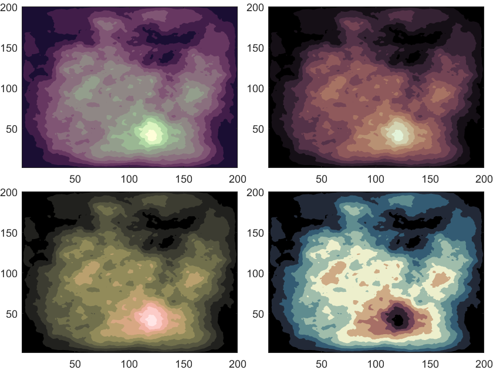
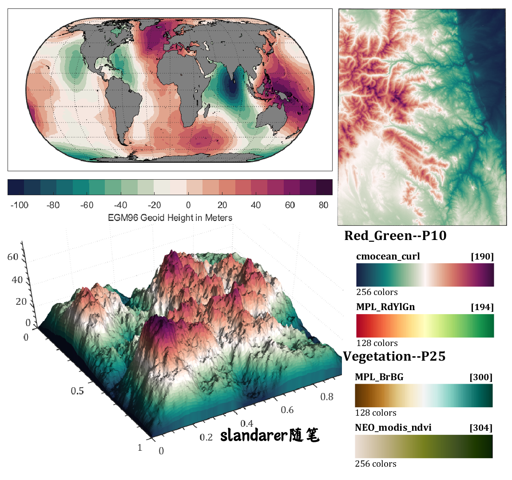
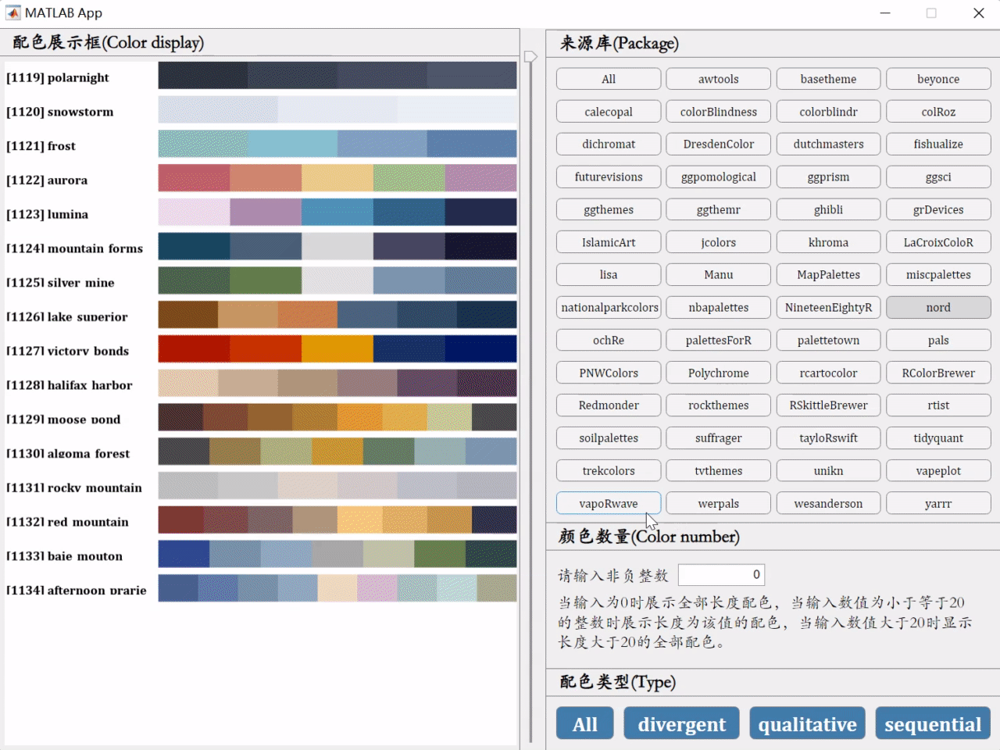
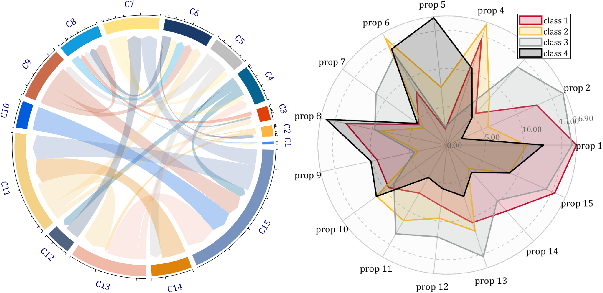
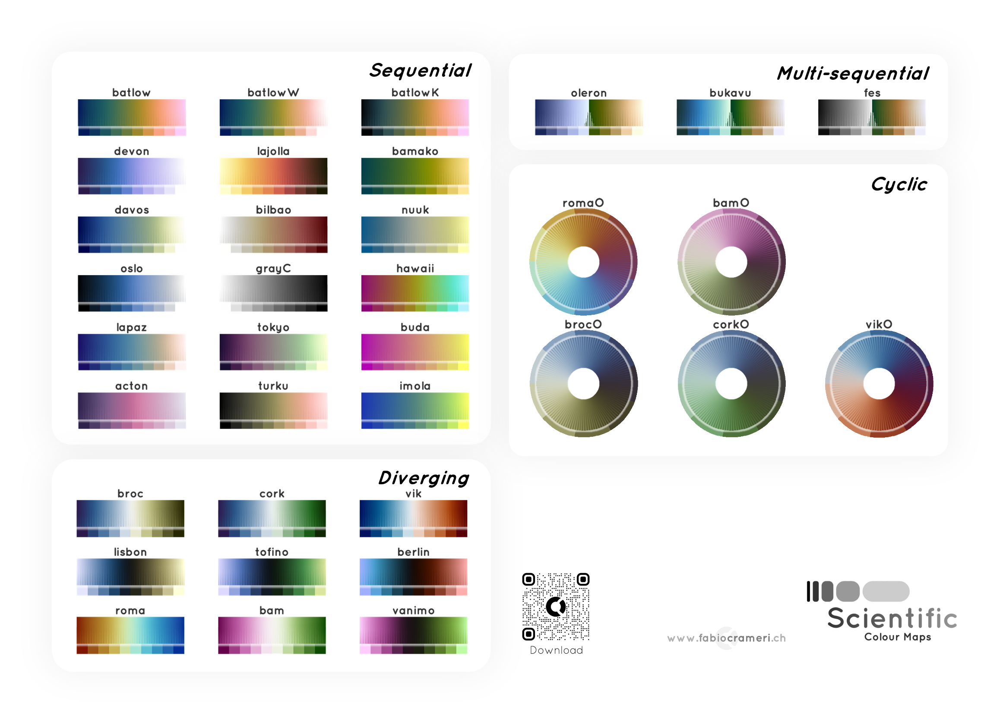
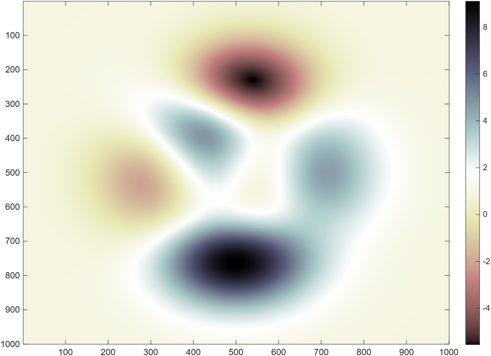
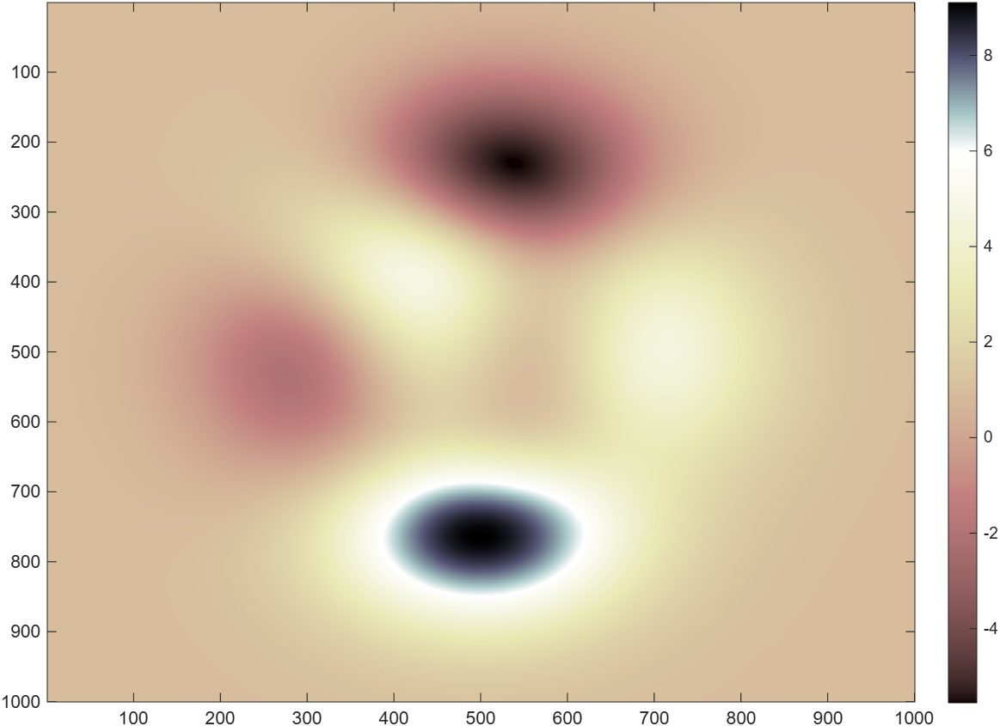

# MATLAB 绘图配色

## 免登录下载链接

### slanCM

链接: https://pan.baidu.com/s/1hlbWZ2N4A2RWm5wxkE_R5A?pwd=slan 提取码: slan \ 
引用格式：Zhaoxu Liu / slandarer (2023). 200 colormaps (https://www.mathworks.com/matlabcentral/fileexchange/120088-200-colormaps), MATLAB Central File Exchange. 检索来源 2023/1/14.

### nclCM

链接：https://pan.baidu.com/s/1s7WTRsQfUahufk6hVUuFRA?pwd=slan \
提取码：slan \

### slanCL




链接: https://pan.baidu.com/s/1l5KHsTWb4esxeWux4MCnTA?pwd=slan \
引用格式：Zhaoxu Liu / slandarer (2023). 2000 palettes (https://www.mathworks.com/matlabcentral/fileexchange/126969-2000-palettes), MATLAB Central File Exchange. 检索来源 2023/3/28.


### scientific colormap 7

链接：https://pan.baidu.com/s/1rPgKAuhs7VQ4Fr73jMVmUw?pwd=slan \
提取码：slan \
引用格式：Crameri, Fabio. (2021). Scientific colour maps (7.0.1). Zenodo. https://doi.org/10.5281/zenodo.5501399 


## colormap中心点重置
+ setColormapPivot(n)
+ setColormapPivot(ax,n)
```matlab
imagesc(peaks(1000)+1)
colormap([pink;flipud(bone)])
colorbar 
% 调整颜色图中点位置
setColormapPivot(7)
```





```matlab
function setColormapPivot(varargin)
% Directly manipulate an existing colormap 
% by shifting its center to a specified value.
% =========================================================================
% Basic usage : supporting 4 calling patterns:
%   1. setColormapPivot()              -> use current axes(gca) , pivot move to 0
%   2. setColormapPivot(ax)            -> use specified axes    , pivot move to 0
%   3. setColormapPivot(value)         -> use current axes(gca) , pivot move specified value
%   4. setColormapPivot(ax, value)     -> use specified axes    , pivot move specified value
% =========================================================================
switch nargin
    case 0, ax = gca; value = 0;
    case 1
        if isa(varargin{1},'matlab.graphics.axis.Axes')
            ax = varargin{1}; value = 0; 
        else
            ax = gca; value = varargin{1};
        end
    case 2, ax = varargin{1}; value = varargin{2};
end

% - R2014b+  : 'CLim'
% - Older    : 'ColorLimits'
if isprop(ax, 'CLim')
    CLim = ax.CLim;
else
    CLim = ax.ColorLimits;
end
 
CLen = [value - CLim(1), CLim(2) - value]; 
CMap = colormap(ax); N = size(CMap, 1); 

% =========================================================================
% Algorithm based on colormap size:
% -------------------------------------------------------------------------
% Small colormaps (< 120 colors)  : Use integer-ratio-based sampling
% Large colormaps (>= 120 colors) : Use continuous interpolation
% -------------------------------------------------------------------------
% The threshold 120 is empirically chosen for optimal visual quality.
% =========================================================================
if N < 120
    % If the specified value falls within the color limits.
    if all(CLen > 0)
        D = min(300, round(5e3/N));
        [CV, CI0] = sort(CLen);
        [RN, RD] = rat(round(CV(1)/CV(2).*D)./D);
        if RD ~= 1
            R = [RN, RD]; R = R(CI0);
            CL1 = CMap(1:floor(N/2), :);
            CL2 = CMap((floor(N/2) + 1):end, :);
            if mod(N, 2) ~= 0
                CL3 = CL2(1,:); CL2(1,:) = [];
                CI1 = kron((1:size(CL1, 1))', ones(R(1)*2, 1));
                CI2 = kron((1:size(CL2, 1))', ones(R(2)*2, 1));
                CMap = [CL1(CI1, :); repmat(CL3, [R(1) + R(2), 1]); CL2(CI2,:)];
            else
                CI1 = kron((1:size(CL1, 1))', ones(R(1), 1));
                CI2 = kron((1:size(CL2, 1))', ones(R(2), 1));
                CMap = [CL1(CI1, :); CL2(CI2, :)];
            end
        end
    else
        CL1 = CMap(1:floor(N/2), :);
        CL2 = CMap((floor(N/2) + 1):end, :);
        CI1 = kron((1:size(CL1, 1))', ones(2, 1));
        CI2 = kron((1:size(CL2, 1))', ones(2, 1));
        CL1 = CL1(CI1, :); CL2 = CL2(CI2, :);
        if length(CL2) > length(CL1)
            CL1(end + 1, :) = CL2(1, :);
            CL2(1, :) = [];
        end
        if CLen(1) <= 0    % Pivot at or below minimum
            CMap = CL2;    % Use right half only
        else               % Pivot at or above maximum
            CMap = CL1;    % Use left half only
        end

    end
else
    VRat = (value - min(CLim))/abs(diff(CLim));
    OInd = linspace(0, 1, N).'; NInd = OInd.*0;
    LBool = OInd <= VRat;
    RBool = OInd >= VRat;
    NInd(LBool) = .5.*OInd(LBool)./VRat;
    NInd(RBool) = .5.*(OInd(RBool) - VRat)./(1 - VRat) + .5;
    CMap = interp1(OInd, CMap, NInd, 'linear');
    CMap = max(0, min(1, CMap));
end
colormap(ax, CMap);
end
```
## 非等据颜色分割
将任意比例点放置在任意数值处：
```matlab
function setCMapRatio(varargin)
% @author:slandarer
if nargin==2
    ax=gca;
    oriRatio=sort(varargin{1});
    breakPnt=sort(varargin{2});
elseif nargin==3
    ax=varargin{1};
    oriRatio=sort(varargin{2});
    breakPnt=sort(varargin{3});
end
% 原始数据处理
CLimit=get(ax,'CLim');
breakPnt=[CLimit(1),breakPnt,CLimit(2)];
newRatio=diff(breakPnt);
oriCMap=colormap(ax);
CLen=size(oriCMap,1);
newRatio=newRatio./diff([0,oriRatio,1]);
newRatio=round(newRatio./max(newRatio).*400);
oriRatio=[oriRatio,1];
% 最开始部分颜色条构造
tempCMap=oriCMap(1:ceil(oriRatio(1).*CLen),:);
CInd2=kron((1:size(tempCMap,1)-1)',ones(newRatio(1),1));
newCMap=tempCMap(CInd2,:);
CInd3=oriRatio(1).*CLen-size(tempCMap,1)+1;
CInd3=round(CInd3.*newRatio(1));
newCMap=[newCMap;repmat(tempCMap(end,:),[CInd3,1])];
% 循环添加新的颜色
for i=2:length(oriRatio)
    CInd1=round(newRatio(i).*(ceil(oriRatio(i-1).*CLen)-oriRatio(i-1).*CLen));
    if abs(ceil(oriRatio(i).*CLen)-oriRatio(i).*CLen)>0
        CInd2=ceil(oriRatio(i-1).*CLen)+1:ceil(oriRatio(i).*CLen)-1;
    else
        CInd2=ceil(oriRatio(i-1).*CLen)+1:ceil(oriRatio(i).*CLen);
    end
    CInd2=kron(CInd2',ones(newRatio(i),1));
    CInd3=round(newRatio(i).*(oriRatio(i).*CLen-floor(oriRatio(i).*CLen)));
    if ceil(oriRatio(i).*CLen)==ceil(oriRatio(i-1).*CLen)
        CInd1=[];
        CInd3=round(newRatio(i).*(oriRatio(i).*CLen-oriRatio(i-1).*CLen));
    end
    newCMap=[newCMap;
        repmat(oriCMap(ceil(oriRatio(i-1).*CLen),:),[CInd1,1]);
        oriCMap(CInd2,:);
        repmat(oriCMap(ceil(oriRatio(i).*CLen),:),[CInd3,1])];
end
colormap(ax,newCMap);
end
```
非等据刻度值生成：
```matlab
function cbTick=getCBTick(ax)
% @author:slandarer
if nargin<1,ax=gca;end
CMap=colormap(ax);
[~,Cind,~]=unique(CMap,'rows');
Cind=sort(Cind);
Cind=Cind(2:end)-1;
CLimit=get(ax,'CLim');
N=size(CMap,1);
Cind=Cind./N;
cbTick=[CLimit(1);CLimit(1)+(CLimit(2)-CLimit(1)).*Cind;CLimit(2)];
end
```
实例：
```matlab
contourf(rand(10,10))
colormap([pink(11);flipud(bone(11))])
cb=colorbar;

setCMapRatio([8/22,10/22,20/22],[.2,.5,.8])

% 添加非等距离标签
cb.YTick=getCBTick(gca);
% 调节colorbar刻度长度(这句代码可删掉)
cb.TickLength=.061;
```


## 自然配色


链接：https://pan.baidu.com/s/1BzLWKmujs2tSGBEdeZaWVA?pwd=slan \
提取码：slan 
