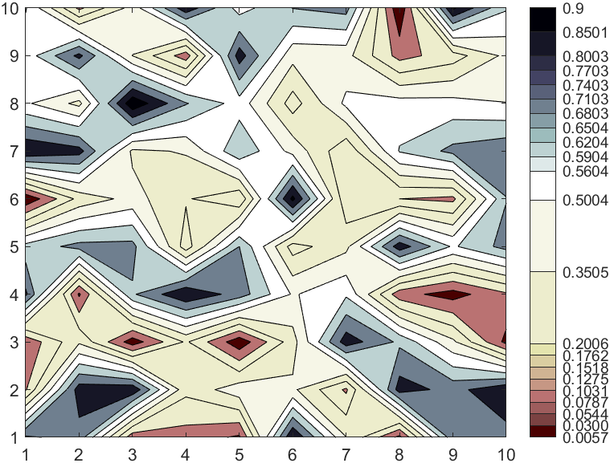
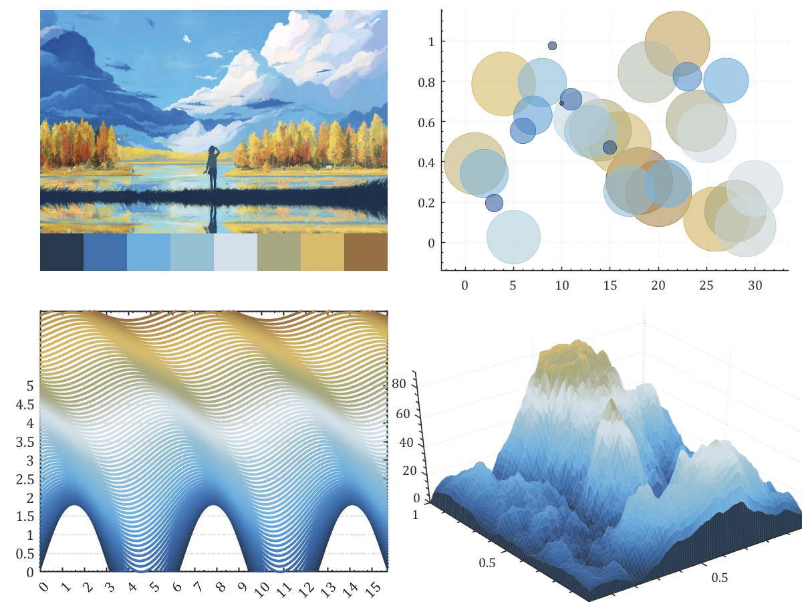
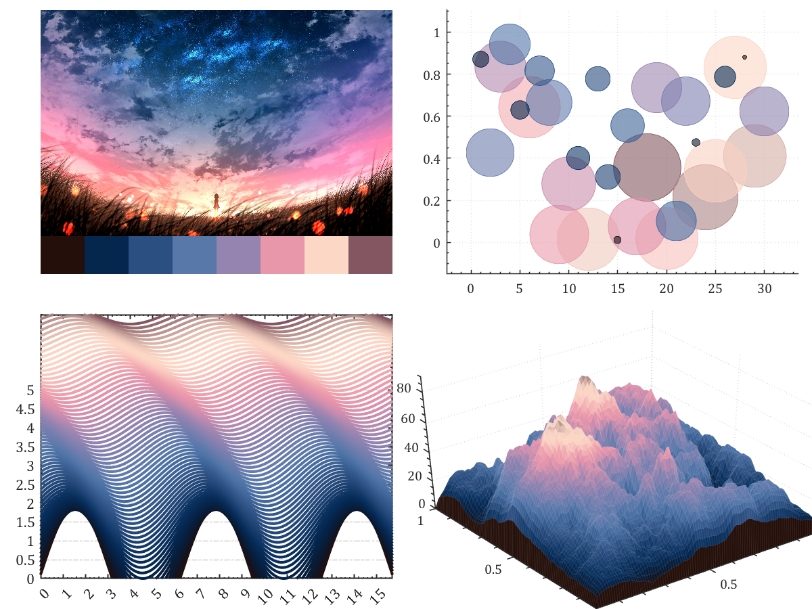

# MATLAB colormaps and palettes

## slanCM

Zhaoxu Liu / slandarer (2026). 200 colormaps (https://www.mathworks.com/matlabcentral/fileexchange/120088-200-colormaps), MATLAB Central File Exchange. Retrieved May 5, 2026.

### Citations & Acknowledgements
+ Hunter, J. D. (2007). Matplotlib: A 2D graphics environment. Computing in Science & Engineering, 9(3), 90–95.
+ Bury, T. (2023). scicomap: Scientific colormaps for Python. https://github.com/ThomasBury/scicomap
+ van der Velden, E. (2020). CMasher: Scientific colormaps for Python. https://cmasher.readthedocs.io/
+ Crameri, F. (2018). Scientific colour maps. Zenodo. https://doi.org/10.5281/zenodo.1243862
+ Thyng, K. M., Greene, C. A., Hetland, R. D., Zimmerle, H. M., & DiMarco, S. F. (2016). True colors of oceanography. Oceanography, 29(3), 10-11. https://doi.org/10.5670/oceanog.2016.66
+ Kovesi, P. (2015). *Good Colour Maps: How to Design Them*. arXiv:1509.03700
+ Glasbey, C. A., van der Heijden, G. W. A. M., Toh, V. F. K., & Gray, A. (2007). Colour displays for categorical images. *Color Research & Application*, 32(4), 304–309. https://doi.org/10.1002/col.20327
+ Davis, M. (2023). palettable: Color Palettes for Python [Computer software]. Retrieved from https://jiffyclub.github.io/palettable/


## nclCM

Zhaoxu Liu / slandarer (2026). NCL colormaps (https://www.mathworks.com/matlabcentral/fileexchange/120848-ncl-colormaps), MATLAB Central File Exchange. Retrieved May 5, 2026.

### Citations & Acknowledgements
All colormap data in this file are sourced from 
NCAR Command Language (NCL)
Website: https://www.ncl.ucar.edu/Document/Graphics/color_tables.shtml


## slanCL


Zhaoxu Liu / slandarer (2026). 2000 palettes (https://www.mathworks.com/matlabcentral/fileexchange/126969-2000-palettes), MATLAB Central File Exchange. Retrieved May 5, 2026.

### Acknowledgement & Source:
All palettes come from the following 55 color packages:

    'awtools'/'basetheme'/'beyonce'/'calecopal'/'colorBlindness'/'colorblindr'
    'colRoz'/'dichromat'/'DresdenColor'/'dutchmasters'/'fishualize'/'futurevisions'
    'ggpomological'/'ggprism'/'ggsci'/'ggthemes'/'ggthemr'/'ghibli'/'grDevices'
    'IslamicArt'/'jcolors'/'khroma'/'LaCroixColoR'/'lisa'/'Manu'/'MapPalettes'
    'miscpalettes'/'nationalparkcolors'/'nbapalettes'/'NineteenEightyR'/'nord'
    'ochRe'/'palettesForR'/'palettetown'/'pals'/'PNWColors'/'Polychrome'
    'rcartocolor'/'RColorBrewer'/'Redmonder'/'rockthemes'/'RSkittleBrewer'
    'rtist'/'soilpalettes'/'suffrager'/'tayloRswift'/'tidyquant'/'trekcolors'
    'tvthemes'/'unikn'/'vapeplot'/'vapoRwave'/'werpals'/'wesanderson'/'yarrr'

## scientific colormap 7

Crameri, Fabio. (2021). Scientific colour maps (7.0.1). Zenodo. https://doi.org/10.5281/zenodo.5501399 


## Set Colormap Pivot
+ setColormapPivot(n)
+ setColormapPivot(ax,n)
```matlab
imagesc(peaks(1000)+1)
colormap([pink;flipud(bone)])
colorbar 

setColormapPivot(7)
```


## Unequal-Interval Color Segmentation
Place anchor points at arbitrary numerical values with arbitrary proportions.
```matlab
contourf(rand(10,10))
colormap([pink(11);flipud(bone(11))])
cb=colorbar;

setCMapRatio([8/22,10/22,20/22],[.2,.5,.8])

% Add non-equidistant / unequal-interval tick labels
cb.YTick = getCBTick(gca);
% Adjust colorbar tick length (this line can be deleted)
cb.TickLength = 0.061;
```


## Nature-Inspired Color Palette




