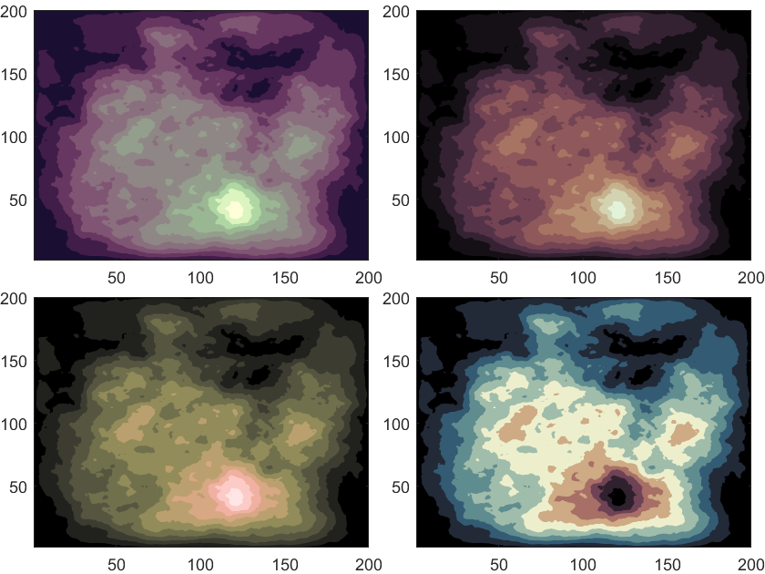

# MATLAB 绘图配色

## 免登录下载链接

### slanCM

链接：https://pan.baidu.com/s/13-EfxRoP4A7HS_gunShNPg?pwd=slan \
提取码：slan \
引用格式：Zhaoxu Liu / slandarer (2023). 200 colormap (https://www.mathworks.com/matlabcentral/fileexchange/120088-200-colormap), MATLAB Central File Exchange. 检索来源 2023/1/14.

### nclCM

链接：https://pan.baidu.com/s/1s7WTRsQfUahufk6hVUuFRA?pwd=slan \
提取码：slan \
引用格式：Zhaoxu Liu / slandarer (2023). ncl colormaps (https://www.mathworks.com/matlabcentral/fileexchange/120848-ncl-colormaps), MATLAB Central File Exchange. 检索来源 2023/1/14.

### slanCL


链接：https://pan.baidu.com/s/1oocjXDOQ_q1myB-1v29kgQ?pwd=slan \
提取码：slan \
引用格式：Zhaoxu Liu / slandarer (2023). 2000 palettes (https://www.mathworks.com/matlabcentral/fileexchange/126969-2000-palettes), MATLAB Central File Exchange. 检索来源 2023/3/28.


### scientific colormap 7

链接：https://pan.baidu.com/s/1rPgKAuhs7VQ4Fr73jMVmUw?pwd=slan \
提取码：slan \
引用格式：Crameri, Fabio. (2021). Scientific colour maps (7.0.1). Zenodo. https://doi.org/10.5281/zenodo.5501399 


## colormap中心点重置
+ setPivot(n)
+ setPivot(ax,n)


```matlab
function setPivot(varargin)
% @author:slandarer
if nargin==0
    ax=gca;pivot=0;
else
    if isa(varargin{1},'matlab.graphics.axis.Axes')
        ax=varargin{1};
        if nargin>1
            pivot=varargin{2};
        else
            pivot=0;
        end
    else
        ax=gca;pivot=varargin{1};
    end
end
CLimit=get(ax,'CLim');
% CMap=get(ax,'Colormap');
CMap=colormap(ax);

CLen=[pivot-CLimit(1),CLimit(2)-pivot];
if all(CLen>0)
    [CV,CInd]=sort(CLen);
    CRatio=round(CV(1)/CV(2).*300)./300;
    CRatioCell=split(rats(CRatio),'/');
    if length(CRatioCell)>1
        Ratio=[str2double(CRatioCell{1}),str2double(CRatioCell{2})];
        Ratio=Ratio(CInd);
        N=size(CMap,1);
        CList1=CMap(1:floor(N/2),:);
        CList2=CMap((floor(N/2)+1):end,:);
        if mod(N,2)~=0
            CList3=CList2(1,:);CList2(1,:)=[];
            CInd1=kron((1:size(CList1,1))',ones(Ratio(1)*2,1));
            CInd2=kron((1:size(CList2,1))',ones(Ratio(2)*2,1));
            CMap=[CList1(CInd1,:);repmat(CList3,[Ratio(1)+Ratio(2),1]);CList2(CInd2,:)];
        else
            CInd1=kron((1:size(CList1,1))',ones(Ratio(1),1));
            CInd2=kron((1:size(CList2,1))',ones(Ratio(2),1));
            CMap=[CList1(CInd1,:);CList2(CInd2,:)];
        end
        % set(ax,'Colormap',CMap)
        colormap(ax,CMap);
    end
end
end
```